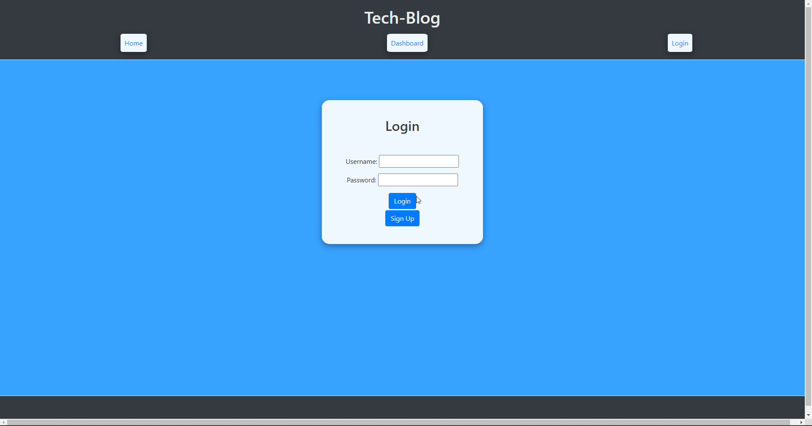
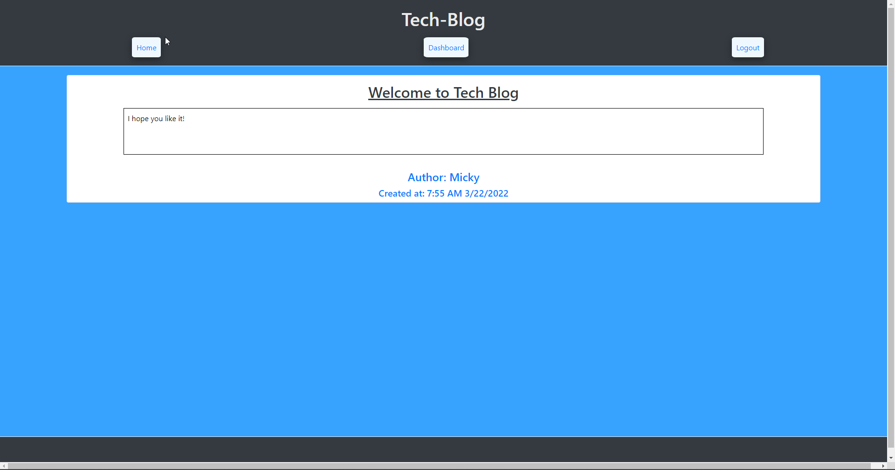
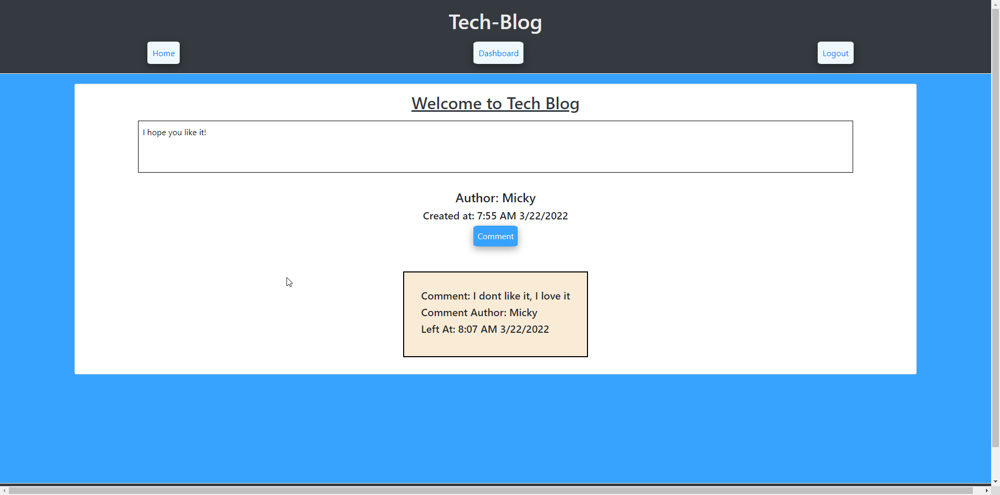

# Michael Ariti - Tech-Blog

[](https://opensource.org/licenses/MIT)

| Table of Contents                               |
| ----------------------------------------------- |
| [1. Description.](#description)                 |
| [2. User Story.](#user-story)                   |
| [3. Acceptance Criteria.](#acceptance-criteria) |
| [4. Installation.](#installation)               |
| [5. Usage.](#usage)                             |
| [6. License.](#license)                         |
| [7. Contributing.](#contributing)               |
| [8. Technologies Used.](#technologies-used)     |
| [9. Screenshot.](#screenshot)                   |
| [10. Application URL.](#application-url)        |
| [11. Questions.](#questions)                    |

## Description

The purpose of this repository is to create a javascript server that runs in node on Heroku which will allow any number of users to post on a tech blog and comment on each others posts.

### Features

```
The ability to create an account and login at a later time.
The ability to create posts.
The ability to delete posts.
The ability to update posts.
The ability to browse by the users posts in dashboard.
the ability to browse by all posts in home.
The ability to create comments on specific posts.
```

## User Story

```md
AS A developer who writes about tech
I WANT a CMS-style blog site
SO THAT I can publish articles, blog posts, and my thoughts and opinions
```

## Acceptance Criteria

```md
GIVEN a CMS-style blog site
WHEN I visit the site for the first time
THEN I am presented with the homepage, which includes existing blog posts if any have been posted; navigation links for the homepage and the dashboard; and the option to log in
WHEN I click on the homepage option
THEN I am taken to the homepage
WHEN I click on any other links in the navigation
THEN I am prompted to either sign up or sign in
WHEN I choose to sign up
THEN I am prompted to create a username and password
WHEN I click on the sign-up button
THEN my user credentials are saved and I am logged into the site
WHEN I revisit the site at a later time and choose to sign in
THEN I am prompted to enter my username and password
WHEN I am signed in to the site
THEN I see navigation links for the homepage, the dashboard, and the option to log out
WHEN I click on the homepage option in the navigation
THEN I am taken to the homepage and presented with existing blog posts that include the post title and the date created
WHEN I click on an existing blog post
THEN I am presented with the post title, contents, post creator’s username, and date created for that post and have the option to leave a comment
WHEN I enter a comment and click on the submit button while signed in
THEN the comment is saved and the post is updated to display the comment, the comment creator’s username, and the date created
WHEN I click on the dashboard option in the navigation
THEN I am taken to the dashboard and presented with any blog posts I have already created and the option to add a new blog post
WHEN I click on the button to add a new blog post
THEN I am prompted to enter both a title and contents for my blog post
WHEN I click on the button to create a new blog post
THEN the title and contents of my post are saved and I am taken back to an updated dashboard with my new blog post
WHEN I click on one of my existing posts in the dashboard
THEN I am able to delete or update my post and taken back to an updated dashboard
WHEN I click on the logout option in the navigation
THEN I am signed out of the site
WHEN I am idle on the site for more than a set time
THEN I am able to view comments but I am prompted to log in again before I can add, update, or delete comments
```

## Installation

To install this app you are required to have MySQL set up and configured. Open the server.js file in a node terminal and use the command `npm install` to install the dependencies. Copy and rename the .env.EXAMPLE file as .env and then add your MYSQL details to the .env file (user is default set to root.) then open another terminal on the schema.sql run the command `mysql -u root -p` to start the mysql, then run source schema.sql to initialise the databse. If you wish to use the seed values then run `npm run seed` in the node terminal. Run `npm start` to begin the app.

## Usage

To use this app run `server.js` and open local port 3001 in your browser.

## License

This project uses the MIT license.

## Contributing

If you would like to contribute to the project please message my github.

## Technologies Used

1. Javascript
2. Node.js
3. SQL
4. Sequelize
5. Express.js
6. dotenv
7. JawsDB
8. Heroku
9. bcrypt
10. handlebars.js
11. CSS
12. HTML5

## Screenshot





## Application URL

[URL](https://mickeytechblog.herokuapp.com/blog)

## Questions

If you have Questions or tips please email me at the address below.

### Email

MichaelAriti94@gmail.com

### End

Michael Ariti 2022
